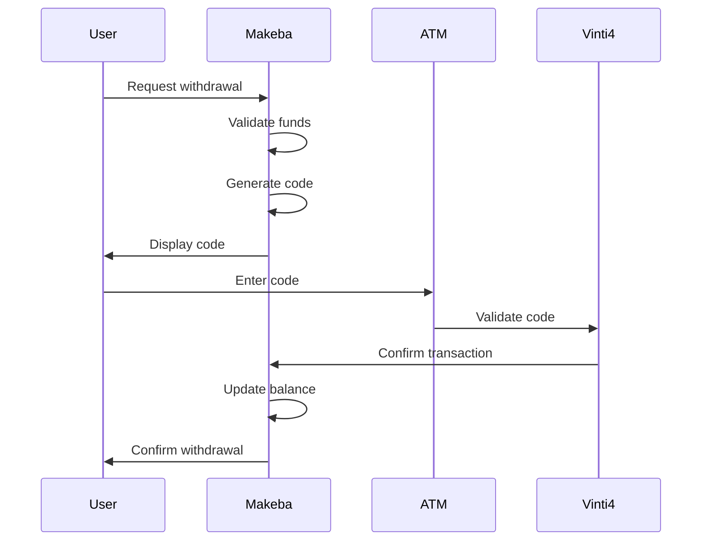
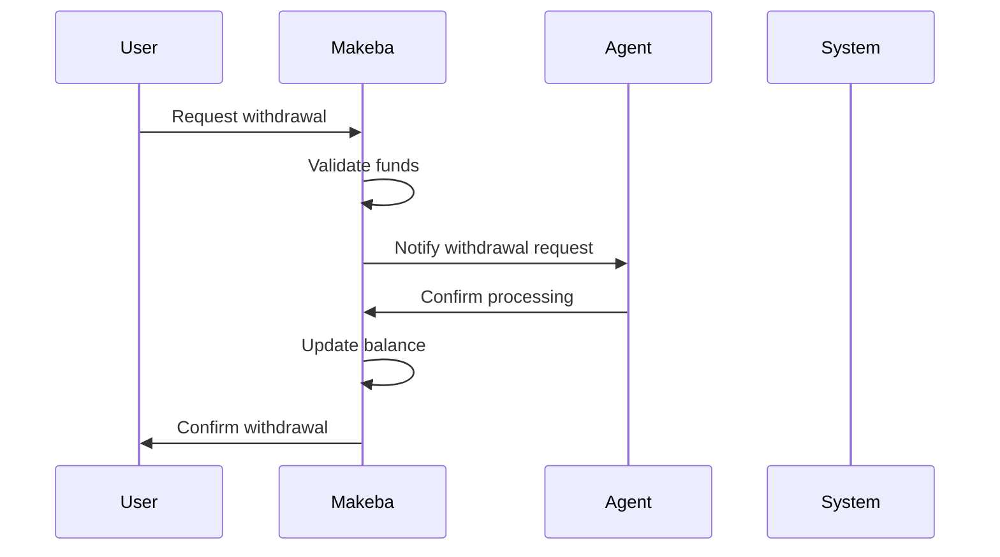

# Banking Flow Technical Specification

## Section 1: Overview and Core Architecture

### Overview
This document outlines the technical specifications for the banking flow implementation in the Makeba/Unitel T+ platform, focusing on deposit and withdrawal features. The system ensures secure, efficient, and real-time money movement between users and agents.

### System Architecture

#### Core Components
1. **Digital Wallet System**
   - Real-time balance management
   - Transaction history tracking
   - Fund availability validation

2. **ATM Integration System**
   - Vinti4 Network integration
   - Code generation and validation
   - Transaction status monitoring

3. **Agent Management System**
   - Agent authentication and authorization
   - Transaction processing
   - Balance management

4. **Transaction Processing System**
   - Real-time transaction execution
   - Balance updates
   - Transaction status tracking

## Section 2: Technical Requirements

### 1. Digital Wallet System
- **Balance Management**
  - Real-time balance updates
  - Transaction history maintenance
  - Fund availability checks
  - Minimum balance enforcement

- **Transaction Processing**
  - Atomic transactions
  - Transaction rollback capability
  - Concurrent transaction handling
  - Transaction status tracking

### 2. ATM Integration (Vinti4 Network)
- **Code Generation System**
  - Secure code generation algorithm
  - Code expiration management
  - One-time use validation
  - Code format: 6-digit numeric code

- **Integration Requirements**
  - RESTful API endpoints
  - Secure communication protocol
  - Transaction status polling
  - Error handling and recovery

### 3. Agent Management
- **Authentication**
  - Multi-factor authentication
  - Session management
  - Role-based access control
  - Activity logging

- **Transaction Processing**
  - Real-time transaction validation
  - Transaction limits management
  - Fraud detection
  - Transaction reporting

## Section 3: User Stories and Implementation

### 1. ATM Withdrawal Flow


#### Implementation Details
1. **Code Generation**
   - Generate unique 6-digit code
   - Set 15-minute expiration
   - Store in secure database
   - Link to user session

2. **Code Validation**
   - Real-time code verification
   - One-time use enforcement
   - Expiration check
   - Transaction amount validation

3. **Balance Update**
   - Atomic transaction processing
   - Real-time balance update
   - Transaction history update
   - Status notification

### 2. Agent Withdrawal Flow


#### Implementation Details
1. **Request Processing**
   - Amount validation
   - Fund availability check
   - Agent assignment
   - Notification system

2. **Transaction Execution**
   - Agent authentication
   - Transaction confirmation
   - Real-time balance update
   - Status tracking

3. **Balance Management**
   - Atomic updates
   - Transaction history
   - Balance reconciliation
   - Audit trail

## Section 4: Security Requirements

### 1. Authentication & Authorization
- Multi-factor authentication
- Session management
- Role-based access control
- Activity logging

### 2. Data Security
- End-to-end encryption
- Secure data storage
- Data transmission security
- Regular security audits

### 3. Transaction Security
- Fraud detection
- Transaction limits
- Suspicious activity monitoring
- Automated alerts

## Section 5: API Specifications

### 1. Withdrawal Endpoints

#### ATM Withdrawal
```http
POST /api/v1/withdrawal/atm
Content-Type: application/json

{
    "amount": number,
    "userId": string
}

Response:
{
    "code": string,
    "expiryTime": string,
    "transactionId": string
}
```

#### Agent Withdrawal
```http
POST /api/v1/withdrawal/agent
Content-Type: application/json

{
    "amount": number,
    "userId": string,
    "agentId": string
}

Response:
{
    "transactionId": string,
    "status": string,
    "timestamp": string
}
```

### 2. Balance Management
```http
GET /api/v1/balance
Authorization: Bearer {token}

Response:
{
    "balance": number,
    "currency": string,
    "lastUpdated": string
}
```

## Section 6: Error Handling

### 1. Common Error Scenarios
- Insufficient funds
- Invalid code
- Expired code
- System errors
- Network issues

### 2. Error Response Format
```json
{
    "error": {
        "code": string,
        "message": string,
        "details": object
    }
}
```

## Section 7: Monitoring and Logging

### 1. Transaction Monitoring
- Real-time transaction tracking
- Status updates
- Performance metrics
- Error tracking

### 2. System Logging
- Transaction logs
- Error logs
- Access logs
- Audit trails

## Section 8: Performance Requirements

### 1. Response Times
- API responses: < 200ms
- Balance updates: < 100ms
- Code generation: < 50ms
- Transaction processing: < 500ms

### 2. System Capacity
- Concurrent users: 10,000+
- Transactions per second: 100+
- 99.9% uptime
- Zero data loss

## Section 9: Testing Requirements

### 1. Unit Testing
- Component testing
- Integration testing
- API testing
- Security testing

### 2. Performance Testing
- Load testing
- Stress testing
- Endurance testing
- Scalability testing

## Section 10: Deployment Requirements

### 1. Infrastructure
- High availability setup
- Load balancing
- Database replication
- Backup systems

### 2. Monitoring
- Real-time monitoring
- Alert systems
- Performance tracking
- Health checks

## Section 11: Maintenance and Support

### 1. Regular Maintenance
- System updates
- Security patches
- Performance optimization
- Database maintenance

### 2. Support Procedures
- Incident response
- User support
- System recovery
- Documentation updates
